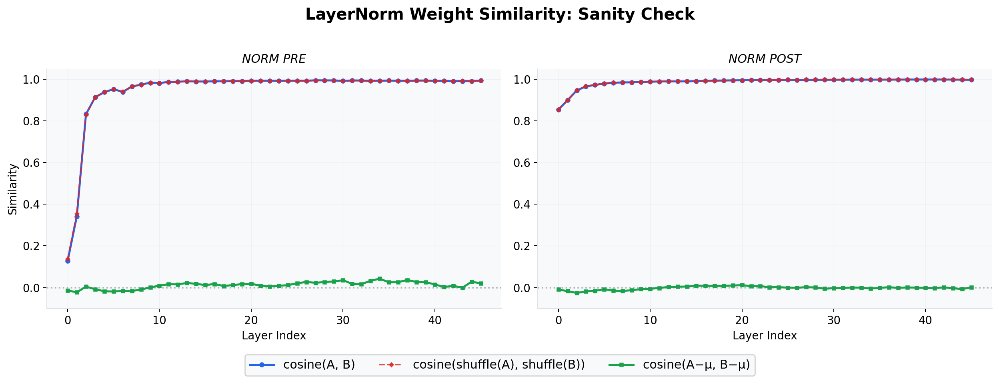

# LayerNorm Cosine Similarity: Sanity Check

**문제**: LayerNorm weight로 두 모델의 유사도를 측정할 때, cosine similarity가 높게 나오면 가중치 재사용의 증거인가?

**가설**: LayerNorm weight는 양수로 초기화되므로, 학습 후에도 대부분 양수. 따라서 **두 독립적인 모델도 cosine similarity가 높게 나올 수 있다.**

## 검증 방법

| 지표 | 수식 | 의미 |
|------|------|------|
| Original | `cosine(A, B)` | 원본 유사도 |
| Shuffled | `cosine(shuffle(A), shuffle(B))` | 순서 무관 baseline |
| Centered | `cosine(A−μ, B−μ)` | 평균 제거 후 (= Pearson) |

## 실행

```bash
pip install huggingface_hub requests numpy matplotlib

python probe_layernorm_sanity.py
```

## 출력

```
out_sanity/
├── layernorm_sanity.csv
└── plot_summary.png
```



- **파란선**: cosine(A, B)
- **빨간선**: cosine(shuffle(A), shuffle(B))
- **초록선**: cosine(A−μ, B−μ)
